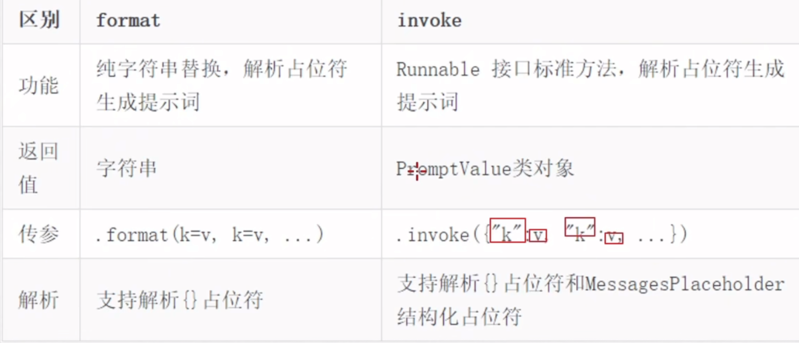

```
pip install openai
pip install langchain langchain-community dashscope chromadb
```

## RAG 检索增强生成

### 余弦相似度 AB点积 ➗ AB模长积

### LangChain支持LLMs、Chat Models、Embeddings Models

### 使用prompt template对象可以进入chain



### chain：上一个组件的输出作为下一个组件的输入 runnable子类才能入chain